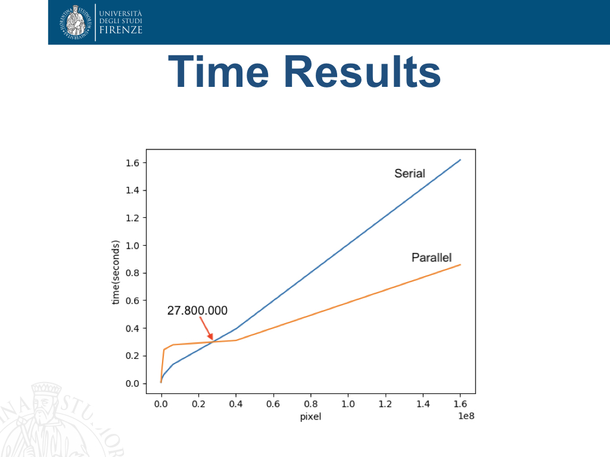

# ParallelComputingExercises

A set of exercises using different technologies and parallel programming paradigms for analyzing parallelism benefits

## Histogram Equalization

For this exercise we used Java for serial implementation and Java threads for the parallel implementation

## Integral Image

For this exercise we used C++ for serial implementation, openMP and CUDA for the parallel implementation

